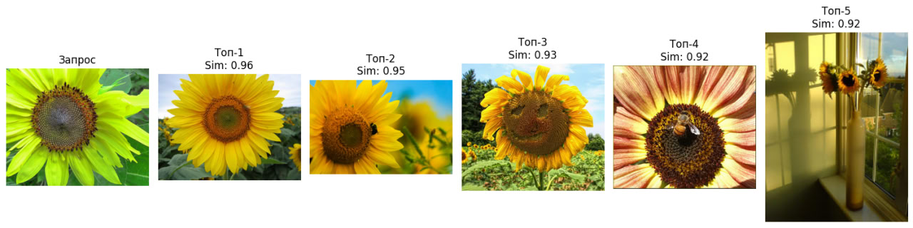

# flower_test
## Запуск
   Для запуска обучения и тестирования следует использовать `train.ipynb`.
   Сервис запускается коммандой `docker compose up --build`.
   Тестировать сервис можно с помощью скрипта `test_service.py`.
   В файле `src/app.py` описан сервис.
   
### Пример результата

## Описание проекта: 
Поиск схожести с использованием EfficientNetV2 и ArcFace

### Архитектура и подход
Для реализации проекта используются следующие компоненты:

1. **EfficientNetV2**  
   В качестве базовой модели для извлечения признаков (feature extraction) используется EfficientNetV2. Эта модель выбрана благодаря её высокой эффективности и производительности в задачах компьютерного зрения. EfficientNetV2 обеспечивает компактные и точные эмбеддинги (векторные представления) для входных данных, что критически важно для последующего сравнения.

2. **ArcFace**  
   Для улучшения качества разделения классов применяется ArcFace — метод, основанный на угловой функции потерь (angular margin loss). ArcFace оптимизирует эмбеддинги так, чтобы:
   - Образцы из разных классов были максимально разделены в пространстве признаков (увеличивается угол между векторами).
   - Образцы из одного класса сближались (уменьшается угол между векторами).  
   Это делает ArcFace особенно подходящим для задач, где требуется высокая точность при сравнении объектов.

3. **Косинусное сходство**  
   Для оценки схожести между эмбеддингами используется метрика косинусного сходства. Косинусное расстояние хорошо подходит для этой задачи, так как:
   - Оно измеряет угол между векторами, игнорируя их длину, что делает его устойчивым к вариациям в масштабе признаков.
   - ArcFace оптимизирует эмбеддинги именно для углового разделения, что делает косинусное сходство естественным выбором для сравнения.

### Обоснование выбора подхода
- **EfficientNetV2** выбрана из-за её эффективности и способности извлекать высококачественные признаки при относительно низких вычислительных затратах.
- **ArcFace** используется для улучшения разделимости классов в пространстве эмбеддингов, что особенно важно для задач поиска схожести, где необходимо минимизировать ложные срабатывания.
- **Косинусное сходство** идеально сочетается с ArcFace, так как оба метода опираются на угловые характеристики векторов, что обеспечивает высокую точность при сравнении.
